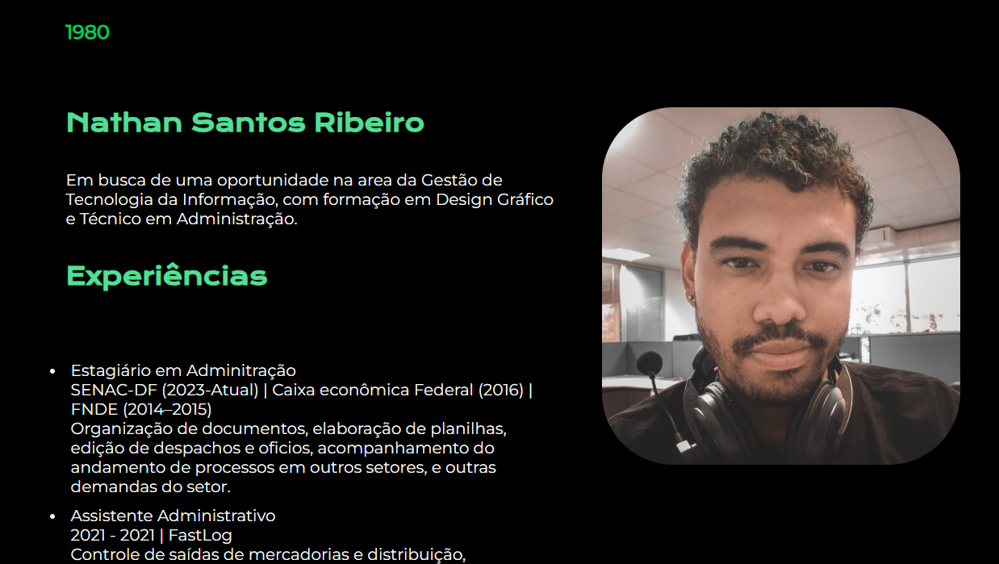
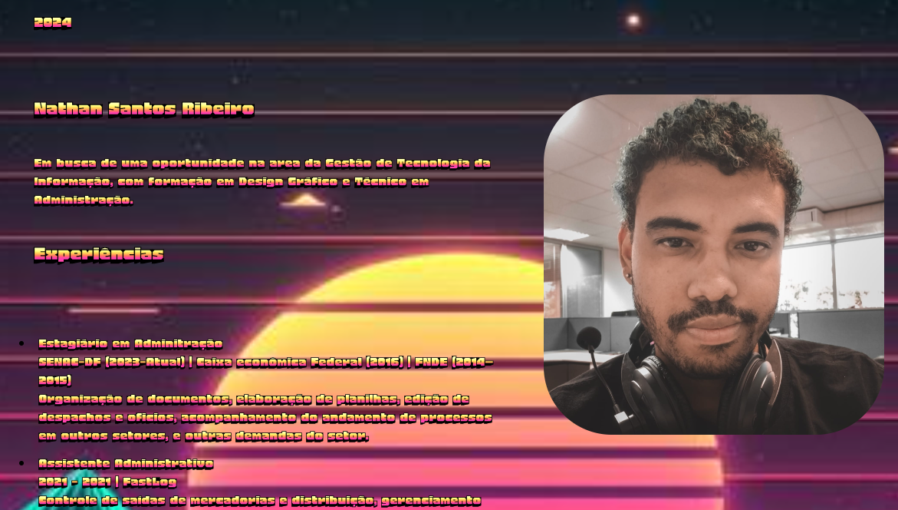

# Currículo HTML | Faculdade SENAC DF | Padrões Web

Status: Concluído!

## Sobre o Projeto

---

- Resultado do meu trabalho de Padrões Web 
- Criando um currículo em HTML + CSS


## Principais tecnologias utilizadas 

````
 HTML - CSS 
````
## Funcionalidades
- Mudar de estilo dos anos 80 para estilo 2024, vice-versa


## Imagens Previa 

### ♦ Estilo 2024s
<p align="center" >
     
</p>

### ♦ Estilo 80s
<p align="center" >
     
</p>

